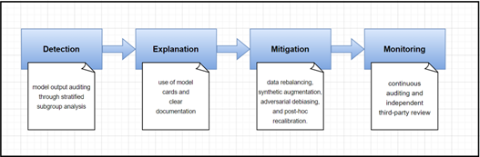
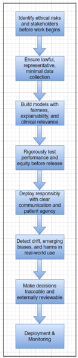

# Data Ethics: AI Ethics in Healthcare Data

## 3.1 Healthcare Data Privacy Challenges

Health data creates unique ethical issues beyond GDPR (General Data Protection Regulation)'s general protections. In the United States of America, HIPAA (Health Insurance Portability and Accountability Act) mandates strict operational controls such as encryption, logging, and risk analysis for Protected Health Information (PHI), with a practical emphasis on security over broad individual rights (OCR, 2025). Internationally, privacy laws differ, and actors such as health apps may fall outside of HIPAA yet still process sensitive data, resulting in inconsistent protections across borders (Sweeney L, 2017).

The most common unresolved challenge is anonymization. It is not sufficient to simply remove identifiers, as re-identification may result from quasi-identifiers or linking of datasets (Sepas A, 2022) (Sweeney, 2000). This makes de-identification a probabilistic, not absolute, safeguard. Ethical data sharing therefore involves trade-offs between research and innovation gains and privacy detriments, using multi-layered approaches such as secure data enclaves, graded access, and contractual oversight (Murdoch, 2021).

AI in healthcare adds more complexity. Biased proxies (Ex: cost as a proxy for need) can formalize systemic injustices, such as when Black patients were under-identified for follow-up care as mentioned in (Obermeyer Z, 2019). Governance breakdowns are also evident in the DeepMind–Royal Free debacle, where patient records were shared without adequate transparency or legal basis (Guardian, 2017).

A realistic healthcare data project plan needs to include legal mapping, purpose limitation, re-identification risk testing, fairness testing, and monitoring over time. Through embedding privacy- and fairness-by-design principles, and accountability through contracts and audits, healthcare organizations will better reconcile ethical imperatives and innovation.

## 3.2 Algorithmic Bias in Medical AI

Medical datasets are biased because they lack representation of specific populations (Examples: missing women's information or minority ethnic groups), geographic differences (urban vs. rural clinics), and socioeconomic issues embedded within surrogates such as insurance status. Biases can distort model predictions.

Upon being incorporated into AI, these biases can maintain or intensify health disparities. As a point of reference, an algorithm widely used in the United States of America underestimated the medical needs of Black patients because it utilized healthcare cost as a surrogate for the severity of illness (Obermeyer Z, 2019). Similarly, pulse oximeters inaccurately measure oxygen levels in individuals with darker skin, leading to disparate treatment for the COVID-19 virus (Sjoding, 2020).

Fairness measures such as demographic parity (symmetric rates of treatment for all groups), equalized odds (equal sensitivity and equal specificity), and calibration (uniformity in accuracy for subgroups) can evaluate such risks (Verma S, 2018).

A structured strategic flow that can be followed as follows:

Ethically, development needs to be constructed on the grounds of justice, beneficence, and responsibility so that vulnerable populations are not negatively impacted. Policy reforms include mandating equity impact assessments, enhancing training data diversity, engaging with affected communities, and setting regulatory requirements for fairness reporting.
## 3.3 Ethical Decision-Making Framework

Data science projects in healthcare need strong ethical governance to protect patient safety, equity, and accountability. An ethics framework assists researchers in embedding values into system development. A key element involves having an ethics checklist to guide decision-making without compromising on patient protection and scientific integrity.

Data integrity is vital where datasets must be original, representative of diversified populations, and collected through minimization policies to avoid unnecessary sensitivity (Kalkman S, 2019). Consent and regulation require legal and moral approvals to align data use with standards such as GDPR and HIPAA (Sandra Wachter, 2017). Fairness entails scrutinizing testing for subgroup bias, identifying disparities, and employing countermeasures to reduce inequities (Obermeyer Z, 2019). Transparency arises from documenting datasets, algorithms, design choices, and limitations so that outcomes stay interpretable and dependable (Rajkomar, 2018). Accountability ensures that accountability for responsibility is clearly established for outcomes, especially where errors or wrongdoing are involved. Constant monitoring is required where models put into practice must be monitored for drift, bias, or adverse impact, with rapid mechanisms of change.

Legacy consent frameworks are pushed to the limit by secondary data use at high volumes. Dynamic consent platforms grant patients ongoing control and feedback, enabling them to engage more ethically (Kalkman S, 2019). GDPR instils patients' rights by requiring meaningful explanation of algorithmic outcomes. Explainability tools such as SHAP and LIME facilitate interpretability but make things harder (Sandra Wachter, 2017). Predictive models also pose risk of stigma and overmedicalization and validation in diverse groups and inclusion of counselling reduce these risks (Topol, 2019).

A sound ethical framework therefore consists of pre-project impact assessments, stakeholder consultation, fairness and transparency audits, and regulation conformity alignment. Institutions should possess interdisciplinary ethics councils, conduct equity audits, and maintain separate accountability structures to ensure responsible, equitable, and trustworthy AI in healthcare.

## 3.4 Stakeholder Impact Analysis

Healthcare AI creates revolutionary opportunities but also asymmetrical risks. For patients, AI can improve access, timely diagnosis, and targeted treatment, but models trained on unrepresentative data sets have the potential to under-serve or even mis-diagnose marginalized populations, while privacy and consent remain persistent concerns (WHO, 2021). For clinicians, AI automates administrative tasks and aids triage but has the potential to contribute to alert fatigue, workflow disruption, liability ambiguity, and deskilling absent regulation (WHO, 2021).

 

For scientists, AI accelerates clinical trial design and biomarker discovery but introduces reproducibility issues, data provenance issues, and perverse incentives such as exaggerating results. Data scientists therefore have ethical responsibility for upholding dataset representativeness, fairness testing, open model documentation, and human-centric governance (Margaret Mitchell, 2019).

Economically, AI promises long-run efficiency gain but involves a high up-front cost in infrastructure, regulation, and training. Vendor lock-in from large vendors poses market threats, while administrative staff displacement requires retraining. Socially, non-universal availability of digital infrastructure may deepen inequalities. Technologies designed in high-resource environments will underachieve in low- and middle-income environments and risk "data colonialism" unless prioritizing local partnerships and capacity-building (Wired, 2020).

 

Global equity requires technical and policy solutions. Approaches such as federated learning and privacy-preserving analytics, in combination with open benchmarks and representative data capture, can counterbalance bias and inclusion. Governance systems need to adopt risk-based regulations, mandate model documentation, mandate reliability post-market monitoring, and formalize clinician co-design and transparent liability rules. Targeted investment in low-resource settings, coupled with equity provisions in reimbursement policies, guarantee benefits more widely.

Together, these strategies align AI innovation with ethical stewardship, allowing technology to improve care and propel research without causing harm, protecting privacy, and reducing global health disparities (WHO, 2021) (Margaret Mitchell, 2019).

## References

1.Guardian, T., 2017. Royal Free breached UK data law in 1.6m patient deal with Google's DeepMind. [Online] 
 Available at: https://www.theguardian.com/technology/2017/jul/03/google-deepmind-16m-patient-royal-free-deal-data-protection-act
 [Accessed 08 09 2025].

2.Kalkman S, M. M. G. C. v. D. J. v. T. G., 2019. Responsible data sharing in international health research: A systematic review of principles and norms. BMC Med Ethics, pp. 20-21.

3.Margaret Mitchell, S. W. A. Z. P. B. L. V. B. H. E. S. I. D. R. T. G., 2019. Model Cards for Model Reporting. Proceedings of the Conference on Fairness, Accountability, and Transparency, pp. 220-229.

4.Murdoch, B., 2021. Privacy and artificial intelligence: challenges for protecting health information in a new era. BMC Med Ethics, Volume 22, p. 122.

5.Nicola Rieke, J. H. W. L. F. M. H. R. R. S. A. S. B. M. N. G. B. A. L. K. M.-H. S. O. M. S. R. M. S. A. T. D. X., 2020. The future of digital health with federated learning. NPJ digital medicine.

6.Obermeyer Z, P. B. V. C. M. S., 2019. Dissecting Racial Bias in an Algorithm that Guides Health Decisions for 70 Million People. New York, N.Y., Science.

7.OCR, O. f. C. R., 2025. Summary of the HIPAA Privacy Rule. [Online] 
 Available at: https://www.hhs.gov/hipaa/for-professionals/privacy/laws-regulations/index.html
 [Accessed 8 9 2025].

8.Rajkomar, A. D. J. a. K. I., 2018. Machine Learning in Medicine. New England Journal of Medicine, p. 1347–1358.

9.Sandra Wachter, B. M. L. F., 2017. Why a Right to Explanation of Automated Decision-Making Does Not Exist in the General Data Protection Regulation. International Data Privacy Law, 7(2), p. 76–99.

10.Sepas A, B. A. A. O. E. E. K. a. E.-H. A., 2022. Algorithms to anonymize structured medical and healthcare data: A systematic review. Frontiers in Bioinformatics, Volume 2.

11.Sjoding, M. W. D. R. P. I. T. J. G. S. E. V. T. S., 2020. Racial Bias in Pulse Oximetry Measurement. The New England journal of medicine, p. 2477–2478.

12.Sweeney L, Y. J. P. L. B. K. B. P. B. J., 2017. Re-identification Risks in HIPAA Safe Harbor Data: A study of data from one environmental health study. Technology Science.

13.Sweeney, L., 2000. Simple Demographics Often Identify People Uniquely. Pittsburgh , Carnegie Mellon University, Data Privacy Working Paper 3.

14.Topol, E., 2019. Deep Medicine: How Artificial Intelligence Can Make Healthcare Human Again. 1 ed. USA: Basic Books, Inc..

15.Verma S, R. J., 2018. Fairness Definitions Explained. Gothenburg, Sweden, IEEE/ACM International Workshop on Software Fairness (FairWare).

16.WHO, W. H. O., 2021. Ethics and governance of artificial intelligence for health. [Online] 
 Available at: https://www.who.int/publications/i/item/9789240029200
 [Accessed 11 09 2025].

17.Wired, 2020. AI Can Help Diagnose Some Illnesses—If Your Country Is Rich. [Online] 
 Available at: https://www.wired.com/story/ai-diagnose-illnesses-country-rich/
 [Accessed 11 09 2025].

18.Zhen Ling Teo, L. J. S. L. D. M. X. Z. W. Y. N. T. F. T. D. M. L. K. J. C. J. H. Y. L. R. S. M. G. D. S. W. T., 2024. Federated machine learning in healthcare: A systematic review on clinical applications and technical architecture.. Cell reports. Medicine.

